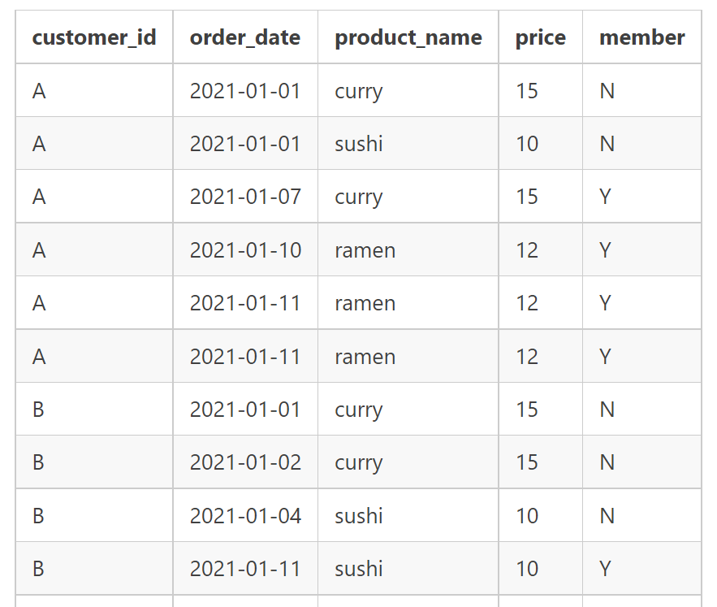
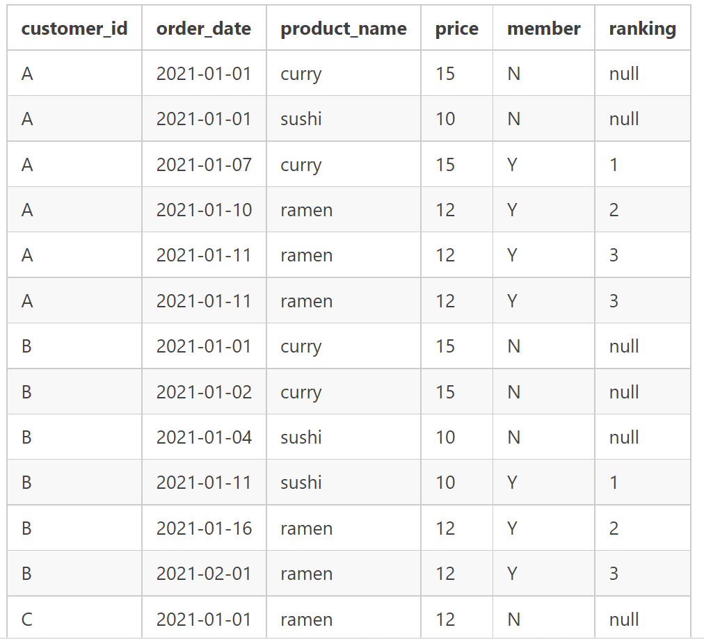

# Case Study #1 - Danny's Diner

> [Markdown style guide ref](https://www.markdownguide.org/basic-syntax/#:~:text=To%20bold%20text%2C%20add%20two,without%20spaces%20around%20the%20letters.&text=I%20just%20love%20**bold%20text**)

> [SQL formatter](https://www.freeformatter.com/sql-formatter.html#ad-output)

## Problem Statement: [Danny's Dinner](https://8weeksqlchallenge.com/case-study-1/)

> [Schema file](SQLSchema/CaseStudy_1_Danny_Diner.sql)

> [ER Image]()

### 1. What is the total amount *each* customer spent at the restaurant?

```sql
SELECT
   m.customer_id,
   SUM(me.[price]) AS amt_spent 
FROM
   [dbo].[members] m 
   LEFT OUTER JOIN
      [dbo].[sales] s 
      ON s.[customer_id] = m.[customer_id] 
   LEFT OUTER JOIN
      [dbo].[menu] me 
      ON me.[product_id] = s.[product_id] 
GROUP BY
   m.customer_id
```

### 2. How many **days** has each customer visited the restaurant?

```sql
SELECT
   customer_id,
   COUNT(DISTINCT([order_date])) AS total_visits 
FROM
   [dbo].[sales] 
GROUP BY
   customer_id
```

### 3. What was the ***first item*** from the menu purchased by each customer?

```sql
WITH order_rank
     AS (SELECT m.[product_name],
                s.[customer_id],
                S.[order_date],
                Rank()
                  OVER (
                    partition BY s.[customer_id]
                    ORDER BY S.[order_date] ASC) AS date_rank
         FROM   [dbo].[menu] m
                LEFT JOIN [dbo].[sales] s
                       ON m.[product_id] = s.[product_id])
SELECT *
FROM   order_rank
WHERE  date_rank = 1
```

### 4. What is the most purchased item on the menu and how many times was it purchased by all customers?

```sql
SELECT
   top 1 m.[product_name],
   COUNT(s.[product_id]) AS product_cnt 
FROM
   [dbo].[sales] s 
   LEFT JOIN
      [dbo].[menu] m 
      ON m.[product_id] = s.[product_id] 
GROUP BY
   m.[product_name] 
ORDER BY
   COUNT(s.[product_id]) DESC
```

### 5. Which item was the most popular for each customer?

```sql
WITH popular AS 
(
   SELECT
      s.[customer_id],
      m.[product_name],
      DENSE_RANK() OVER (PARTITION BY s.[customer_id] 
   ORDER BY
      COUNT(s.[product_id]) DESC) AS rnk 
   FROM
      [dbo].[sales] s 
      LEFT JOIN
         [dbo].[menu] m 
         ON m.[product_id] = s.[product_id] 
   GROUP BY
      s.[customer_id],
      m.[product_name] 
)
SELECT
   [customer_id],
   [product_name] 
FROM
   popular 
WHERE
   rnk = 1
```

### 6. Which item was purchased first by the customer after they became a member?

```sql
WITH first_purchase AS 
(
   SELECT
      m.[customer_id],
      me.[product_name],
      s.[order_date],
      m.[join_date],
      RANK() OVER (PARTITION BY m.[customer_id] 
   ORDER BY
      s.[order_date] ASC ) AS first_pur 
   FROM
      [dbo].[sales] s 
      LEFT JOIN
         [dbo].[members] m 
         ON s.[customer_id] = m.[customer_id] 
      LEFT JOIN
         [dbo].[menu] me 
         ON me.[product_id] = s.[product_id] 
   WHERE
      s.[order_date] >= m.[join_date] 
)
SELECT
   [customer_id],
   [product_name],
   [order_date],
   [join_date] 
FROM
   first_purchase 
WHERE
   first_pur = 1
```

### 7. Which item was purchased just before the customer became a member?

```sql
WITH first_purchase AS 
(
   SELECT
      m.[customer_id],
      me.[product_name],
      s.[order_date],
      m.[join_date],
      DENSE_RANK() OVER (PARTITION BY m.[customer_id] 
   ORDER BY
      s.[order_date] DESC ) AS first_pur 
   FROM
      [dbo].[sales] s 
      LEFT JOIN
         [dbo].[members] m 
         ON s.[customer_id] = m.[customer_id] 
      LEFT JOIN
         [dbo].[menu] me 
         ON me.[product_id] = s.[product_id] 
   WHERE
      s.[order_date] < m.[join_date] 
)
SELECT
   [customer_id],
   [product_name],
   [order_date],
   [join_date] 
FROM
   first_purchase 
WHERE
   first_pur = 1
```

### 8. What is the total items and amount spent for each member before they became a member?

```sql
SELECT
   m.[customer_id],
   COUNT(DISTINCT(me.[product_name])) AS total_items,
   SUM(me.[price]) AS amt_spent 
FROM
   [dbo].[sales] s 
   LEFT JOIN
      [dbo].[members] m 
      ON s.[customer_id] = m.[customer_id] 
   LEFT JOIN
      [dbo].[menu] me 
      ON me.[product_id] = s.[product_id] 
WHERE
   s.[order_date] < m.[join_date] 
GROUP BY
   m.[customer_id]
```

### 9. If each $1 spent equates to 10 points and sushi has a 2x points multiplier - how many points would each customer have?

```sql
WITH points_cal AS 
(
   SELECT
      [customer_id],
      CASE
         WHEN
            (
               m.[product_name]
            )
             = 'sushi' 
         THEN
            SUM(m.[price]) * 20 
         ELSE
            SUM(m.[price])*10 
      END
      AS points 
   FROM
      [dbo].[sales] s 
      LEFT JOIN
         [dbo].[menu] m 
         ON s.[product_id] = m.[product_id] 
   GROUP BY
      [customer_id], m.[product_name] 
)
SELECT
   [customer_id],
   SUM(points) AS points_earned 
FROM
   points_cal 
GROUP BY
   [customer_id]
```

### 10. In the first week after a customer joins the program (including their join date) they earn 2x points on all items, not just sushi - how many points do customer A and B have at the end of January?

```sql
WITH date_range AS 
(
   SELECT
      me.[customer_id],
      me.[join_date],
      dateadd(DAY, 6, me.[join_date]) AS valid_date 
   FROM
      [dbo].[members] me 
)
,
points AS 
(
   SELECT
      dr.[customer_id],
      SUM( 
      CASE
         WHEN
            s.[order_date] < dr.[join_date] 
            AND m.[product_name] != 'sushi' 
         THEN
(m.[price]) *10 
         WHEN
            s.[order_date] < dr.[join_date] 
            AND m.[product_name] = 'sushi' 
         THEN
(m.[price]) *20 
         WHEN
            s.[order_date] >= dr.[join_date] 
            AND s.[order_date] <= dr.[valid_date] 
         THEN
(m.[price]) *20 
         WHEN
            s.[order_date] > dr.[valid_date] 
            AND [product_name] != 'sushi' 
         THEN
(m.[price]) *10 
         ELSE
(m.[price]) * 20 
      END
) AS points_earned 
   FROM
      date_range dr 
      LEFT JOIN
         [dbo].[sales] s 
         ON dr.[customer_id] = s.[customer_id] 
      LEFT JOIN
         [dbo].[menu] m 
         ON m.[product_id] = s.[product_id] 
   WHERE
      s.[order_date] <= '2021-01-31' 
   GROUP BY
      dr.[customer_id], s.[order_date], dr.[join_date], m.[product_name], m.[price], dr.[valid_date] 
)
SELECT
   [customer_id],
   SUM(points_earned) AS earned_month 
FROM
   points 
GROUP BY
   [customer_id]
```

### Bonus Question-Join All The Things and recreate as below:


```sql
SELECT s.customer_id, s.order_date, m.product_name, m.price,
   CASE
      WHEN mm.join_date > s.order_date THEN 'N'
      WHEN mm.join_date <= s.order_date THEN 'Y'
      ELSE 'N'
      END AS member
FROM sales AS s
LEFT JOIN menu AS m
   ON s.product_id = m.product_id
LEFT JOIN members AS mm
   ON s.customer_id = mm.customer_id
```

### Bonus Question-Rank each record orders based on purchase date(null for non-menber days)


```sql
WITH summary_cte AS 
(
   SELECT
      s.customer_id,
      s.order_date,
      m.product_name,
      m.price,
      CASE
         WHEN
            mm.join_date > s.order_date 
         THEN
            'N' 
         WHEN
            mm.join_date <= s.order_date 
         THEN
            'Y' 
         ELSE
            'N' 
      END
      AS MEMBER 
   FROM
      sales AS s 
      LEFT JOIN
         menu AS m 
         ON s.product_id = m.product_id 
      LEFT JOIN
         members AS mm 
         ON s.customer_id = mm.customer_id 
)
SELECT
   *,
   CASE
      WHEN
         MEMBER = 'N' 
      THEN
         NULL 
      ELSE
         RANK () OVER(PARTITION BY customer_id, MEMBER 
ORDER BY
   order_date) 
   END
   AS ranking 
FROM
   summary_cte;
```
