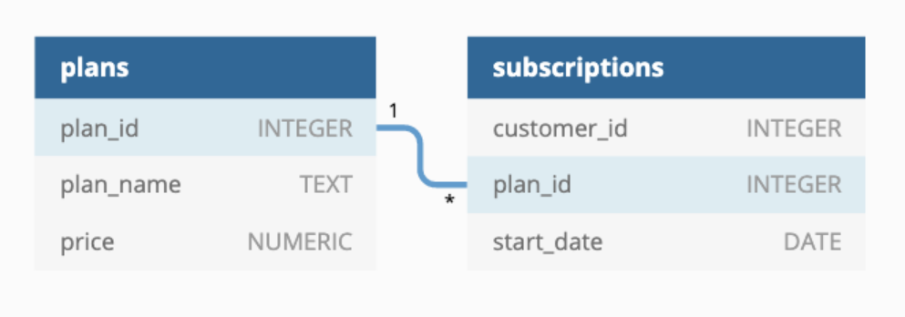
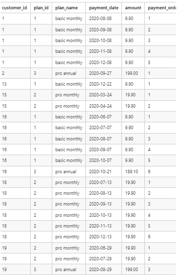

# Case Study 3-Foodie Fi

## Problem Statement: [Foodie Fi](https://8weeksqlchallenge.com/case-study-3/)

> [Schema file](SQLSchema/CaseStudy_3_FoodieFi.sql)




### Status: In Progress

## A. Customer Journey

Based off the 8 sample customers provided in the sample from the subscriptions table, write a brief description about each customer’s onboarding journey.

Try to keep it as short as possible - you may also want to run some sort of join to make your explanations a bit easier!

## B. Data Analysis Questions

### 1. How many customers has Foodie-Fi ever had?

```sql
SET
   search_path TO foodie_fi;
SELECT
   * 
FROM
   plans p 
   LEFT JOIN
      subscriptions s 
      ON p.plan_id = s.plan_id
```

### 2. What is the monthly distribution of trial plan start_date values for our dataset - use the start of the month as the group by value

```sql
SELECT
   to_char(s.start_date, 'yyyy-mm-01')::DATE AS month_start,
   COUNT(s.customer_id) AS customer_count 
FROM
   plans p 
   LEFT JOIN
      subscriptions s 
      ON p.plan_id = s.plan_id 
WHERE
   p.plan_name = 'trial' 
GROUP BY
   month_start 
ORDER BY
   month_start ASC
```

### 3. What plan start_date values occur after the year 2020 for our dataset? Show the breakdown by count of events for each plan_name

```sql
SELECT
   p.plan_name,
   COALESCE(COUNT(s.customer_id), 0) AS customer_count 
FROM
   plans p 
   LEFT JOIN
      subscriptions s 
      ON p.plan_id = s.plan_id 
WHERE
   date_part('year', s.start_date) > 2020 
GROUP BY
   p.plan_name 
ORDER BY
   p.plan_name ASC
```

### 4. What is the customer count and percentage of customers who have churned rounded to 1 decimal place?

```sql
SELECT
   COUNT(s.customer_id) AS churned_count,
   round(100*(COUNT(*)::NUMERIC / (
   SELECT
      COUNT(DISTINCT customer_id) 
   FROM
      subscriptions)), 2) AS churn_percentage 
   FROM
      subscriptions s 
      INNER JOIN
         plans p 
         ON s.plan_id = p.plan_id 
   WHERE
      p.plan_name = 'churn'
```

### 5. How many customers have churned straight after their initial free trial - what percentage is this rounded to the nearest whole number?

```sql
WITH churn_customers AS 
(
   SELECT
      s.customer_id,
      p.plan_name AS initial_plan,
      s.start_date,
      LEAD(p.plan_name) OVER (PARTITION BY s.customer_id 
   ORDER BY
      s.start_date ASC) AS next_plan 
   FROM
      subscriptions s 
      INNER JOIN
         plans p 
         ON s.plan_id = p.plan_id 
   ORDER BY
      s.customer_id 
)
SELECT
   COUNT(customer_id) AS churned_count,
   round(100 * (COUNT(*)::NUMERIC / (
   SELECT
      COUNT(DISTINCT customer_id) 
   FROM
      churn_customers)), 2) AS churned_percent 
   FROM
      churn_customers 
   WHERE
      initial_plan = 'trial' 
      AND next_plan = 'churn'
```

### 6. What is the number and percentage of customer plans after their initial free trial?

```sql
WITH churn_customers AS 
(
   SELECT
      s.customer_id,
      p.plan_name AS initial_plan,
      s.start_date,
      LEAD(p.plan_name) OVER (PARTITION BY s.customer_id 
   ORDER BY
      s.start_date ASC) AS next_plan 
   FROM
      subscriptions s 
      INNER JOIN
         plans p 
         ON s.plan_id = p.plan_id 
   ORDER BY
      s.customer_id 
)
SELECT
   next_plan,
   COUNT(customer_id) AS churned_count,
   round(100 * (COUNT(*)::NUMERIC / (
   SELECT
      COUNT(DISTINCT customer_id) 
   FROM
      churn_customers)), 2) AS churned_percent 
   FROM
      churn_customers 
   WHERE
      initial_plan = 'trial' 
   GROUP BY
      next_plan 
   ORDER BY
      churned_count DESC
```

### 7. What is the customer count and percentage breakdown of all 5 plan_name values at 2020-12-31?

```sql
WITH year_end AS 
(
   SELECT
      s.customer_id,
      p.plan_name,
      DENSE_RANK() OVER (PARTITION BY s.customer_id 
   ORDER BY
      s.start_date DESC) AS rnk 
   FROM
      subscriptions s 
      JOIN
         plans p USING (plan_id) 
   WHERE
      s.start_date <= '2020-12-31' 
)
SELECT
   plan_name,
   COUNT(customer_id) AS eoy_count,
   round(100*( COUNT(customer_id)::NUMERIC / (
   SELECT
      COUNT(*) 
   FROM
      year_end 
   WHERE
      rnk = 1)), 2) AS eoy_percent 
   FROM
      year_end 
   WHERE
      rnk = 1 
   GROUP BY
      plan_name
```

### 8. How many customers have upgraded to an annual plan in 2020?

```sql
WITH churn_customers AS 
(
   SELECT
      s.customer_id,
      p.plan_name AS initial_plan,
      s.start_date,
      LEAD(p.plan_name) OVER (PARTITION BY s.customer_id 
   ORDER BY
      s.start_date ASC) AS next_plan 
   FROM
      subscriptions s 
      INNER JOIN
         plans p 
         ON s.plan_id = p.plan_id 
   WHERE
      date_part('YEAR', s.start_date) = '2020' 
   ORDER BY
      s.customer_id 
)
SELECT
   COUNT(*) 
FROM
   churn_customers 
WHERE
   initial_plan LIKE '%annual%' 
   AND next_plan IS NULL
```

### 9. How many days on average does it take for a customer to an annual plan from the day they join Foodie-Fi?

```sql
WITH initial_plan AS 
(
   SELECT
      s.customer_id,
      p.plan_name,
      MIN(s.start_date) AS join_date 
   FROM
      subscriptions s 
      JOIN
         plans p USING (plan_id) 
   WHERE
      p.plan_name <> 'pro annual' 
   GROUP BY
      s.customer_id,
      p.plan_name 
)
,
annual_plan AS 
(
   SELECT
      s.customer_id,
      p.plan_name,
      s.start_date AS annual_date 
   FROM
      subscriptions s 
      JOIN
         plans p USING (plan_id) 
   WHERE
      p.plan_name = 'pro annual' 
)
SELECT
   round(AVG(annual_date - join_date), 2) AS avg_days 
FROM
   annual_plan a 
   LEFT JOIN
      initial_plan i 
      ON a.customer_id = i.customer_id
```

### 10. Can you further breakdown this average value into 30 day periods (i.e. 0-30 days, 31-60 days etc)

```sql
-- Filter results to customers at trial plan = 0
WITH trial_plan AS 
(
   SELECT
      customer_id,
      start_date AS trial_date 
   FROM
      foodie_fi.subscriptions 
   WHERE
      plan_id = 0 
)
,
-- Filter results to customers at pro annual plan = 3
annual_plan AS 
(
   SELECT
      customer_id,
      start_date AS annual_date 
   FROM
      foodie_fi.subscriptions 
   WHERE
      plan_id = 3 
)
,
-- Sort values above in buckets of 12 with range of 30 days each
bins AS 
(
   SELECT
      WIDTH_BUCKET(ap.annual_date - tp.trial_date, 0, 360, 12) AS avg_days_to_upgrade 
   FROM
      trial_plan tp 
      JOIN
         annual_plan ap 
         ON tp.customer_id = ap.customer_id
)
SELECT
((avg_days_to_upgrade - 1) * 30 || ' - ' || (avg_days_to_upgrade) * 30) || ' days' AS breakdown,
   COUNT(*) AS customers 
FROM
   bins 
GROUP BY
   avg_days_to_upgrade 
ORDER BY
   avg_days_to_upgrade;
```

### 11. How many customers downgraded from a pro monthly to a basic monthly plan in 2020?

```sql
WITH customers AS 
(
   SELECT
      s.customer_id,
      p.plan_name AS initial_plan,
      s.start_date,
      LEAD(p.plan_name) OVER (PARTITION BY s.customer_id 
   ORDER BY
      s.start_date ASC) AS next_plan 
   FROM
      subscriptions s 
      INNER JOIN
         plans p 
         ON s.plan_id = p.plan_id 
   WHERE
      date_part('YEAR', s.start_date) = '2020' 
   ORDER BY
      s.customer_id 
)
SELECT
   COUNT(*) 
FROM
   customers 
WHERE
   initial_plan = 'pro montly' 
   AND next_plan = 'basic'
```

## C. Challenge Payment Question

The Foodie-Fi team wants you to create a new payments table for the year 2020 that includes amounts paid by each customer in the subscriptions table with the following requirements:

* monthly payments always occur on the same day of month as the original start_date of any monthly paid plan
* upgrades from basic to monthly or pro plans are reduced by the current paid amount in that month and start immediately
* upgrades from pro monthly to pro annual are paid at the end of the current billing period and also starts at the end of the month period
* once a customer churns they will no longer make payments
Example outputs for this table might look like the following:



```sql

```

## D. Outside The Box Questions

The following are open ended questions which might be asked during a technical interview for this case study - there are no right or wrong answers, but answers that make sense from both a technical and a business perspective make an amazing impression!

### 1. How would you calculate the rate of growth for Foodie-Fi?

```text
Growth rate should be looked from overall org level(Foodie-Fi) and at plan level.
At org level, %increase in number of customers using Foodie-Fi(month-on-month % increase in MAU)
At plan level, %increase in paying customers.
```

### 2. What key metrics would you recommend Foodie-Fi management to track over time to assess performance of their overall business?

```text
* MAU
* DAU/MAU
* Churn rate
* Annual Recurring Revenue(ARR) and Monthly Recurring Revenue(MRR)
* Average Revenue per User(ARPU)
* Customer Acquisition Costs(CAC)
* Trial Conversion Rate
* Customer Lifetime Value(CLTV)
* LTV:CAC ratio
* Repeat Purchase Ratio
* Existing customer revenue growth rate
* 60-180-360 day retention rate
```

### 3. What are some key customer journeys or experiences that you would analyse further to improve customer retention?

```text
* Funnel drop offs across the app
* UX improvement
* Pricing and promotional analysis
* Retention curves
* Demographic and organic traffic source analysis
```

### 4. If the Foodie-Fi team were to create an exit survey shown to customers who wish to cancel their subscription, what questions would you include in the survey?

```text
1. Why do you want to cancel the subscription?
2. Are there any other alternatives you are considering in place of Foodie-Fi?
3. Would you like to take part in an in-depth personal survey to give us more feedback?
```

### 5. What business levers could the Foodie-Fi team use to reduce the customer churn rate? How would you validate the effectiveness of your ideas?

```text
Validate effectiveness through increase in 30-90-180 day retention rate.
```
