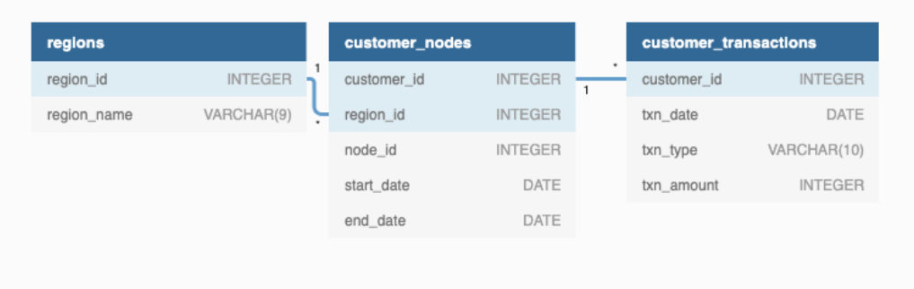

# Case Study 4-Data Bank

## Problem Statement: [Data Bank](https://8weeksqlchallenge.com/case-study-4/)

> [Schema file](SQLSchema/CaseStudy_4_Data_Bank.sql)




### Status: Completed

## A. Customer Nodes Exploration

### 1. How many unique nodes are there on the Data Bank system?

```sql
SELECT
   COUNT(DISTINCT node_id) AS unique_nodes 
FROM
   data_bank.customer_nodes
```

### 2. What is the number of nodes per region?

```sql
SELECT
   r.region_name,
   COUNT(node_id) AS number_of_node 
FROM
   data_bank.customer_nodes n 
   LEFT JOIN
      data_bank.regions r 
      ON n.region_id = r.region_id 
GROUP BY
   r.region_name
```

### 3. How many customers are allocated to each region?

```sql
SELECT
   n.region_name,
   COUNT(cn.customer_id) AS customer_count 
FROM
   data_bank.customer_nodes cn 
   LEFT JOIN
      data_bank.regions n 
      ON cn.region_id = n.region_id 
GROUP BY
   n.region_name
```

### 4. How many days on average are customers reallocated to a different node?

```sql
WITH diff AS 
(
   SELECT
      cn.customer_id,
      cn.node_id,
      cn.start_date,
      cn.end_date,
      cn.end_date - cn.start_date AS date_diff 
   FROM
      data_bank.customer_nodes cn 
      LEFT JOIN
         data_bank.regions n 
         ON cn.region_id = n.region_id 
   WHERE
      cn.end_date != '9999-12-31' 
)
,
datesum AS 
(
   SELECT
      customer_id,
      node_id,
      SUM(date_diff) AS sum_date_diff 
   FROM
      diff 
   GROUP BY
      customer_id,
      node_id 
)
SELECT
   round(AVG(sum_date_diff)) AS avg_reallocation 
FROM
   datesum
```

### 5. What is the median, 80th and 95th percentile for this same reallocation days metric for each region?

```sql
WITH diff AS 
(
   SELECT
      cn.customer_id,
      cn.node_id,
      n.region_name,
      cn.start_date,
      cn.end_date,
      cn.end_date - cn.start_date AS date_diff 
   FROM
      data_bank.customer_nodes cn 
      LEFT JOIN
         data_bank.regions n 
         ON cn.region_id = n.region_id 
   WHERE
      cn.end_date != '9999-12-31' 
)
,
datesum AS 
(
   SELECT
      customer_id,
      node_id,
      region_name,
      SUM(date_diff) AS sum_date_diff 
   FROM
      diff 
   GROUP BY
      customer_id,
      node_id,
      region_name 
)
SELECT
   region_name,
   PERCENTILE_CONT(0.5) WITHIN GROUP (
ORDER BY
   sum_date_diff) AS median_reallocation,
   PERCENTILE_CONT(0.8) WITHIN GROUP (
ORDER BY
   sum_date_diff) AS eightpercentile_reallocation,
   PERCENTILE_CONT(0.95) WITHIN GROUP (
ORDER BY
   sum_date_diff) AS ninethypercentile_reallocation 
FROM
   datesum 
GROUP BY
   region_name
```

## B. Customer Transactions

### 1. What is the unique count and total amount for each transaction type?

```sql
SELECT
   t.txn_type,
   SUM(t.txn_amount) AS total_amount,
   COUNT(*) AS transaction_count 
FROM
   data_bank.customer_transactions t 
GROUP BY
   t.txn_type
```

### 2. What is the average total historical deposit counts and amounts for all customers?

```sql
WITH total_amt AS 
(
   SELECT
      t.customer_id,
      SUM(t.txn_amount) AS total_amount,
      COUNT(*) AS transaction_count 
   FROM
      data_bank.customer_transactions t 
   WHERE
      t.txn_type = 'deposit' 
   GROUP BY
      t.customer_id 
)
SELECT
   AVG(total_amount) AS avg_amount,
   round(AVG(transaction_count)) AS avg_tran_count 
FROM
   total_amt
```

### 3. For each month - how many Data Bank customers make more than 1 deposit and either 1 purchase or 1 withdrawal in a single month?

```sql
WITH customer_txn AS 
(
   SELECT
      date_part('month', ct.txn_date) AS transaction_month,
      ct.customer_id,
      SUM(
      CASE
         WHEN
            ct.txn_type = 'deposit' 
         THEN
            1 
         ELSE
            0 
      END
) AS deposit, SUM(
      CASE
         WHEN
            ct.txn_type = 'purchase' 
         THEN
            1 
         ELSE
            0 
      END
) AS purchase, SUM(
      CASE
         WHEN
            ct.txn_type = 'withdrawal' 
         THEN
            1 
         ELSE
            0 
      END
) AS withdrawal 
   FROM
      data_bank.customer_transactions ct 
      LEFT JOIN
         data_bank.customer_nodes cn 
         ON ct.customer_id = cn.customer_id 
      LEFT JOIN
         data_bank.regions r 
         ON r.region_id = cn.region_id 
   GROUP BY
      ct.txn_date, ct.customer_id 
)
SELECT
   transaction_month,
   COUNT(DISTINCT customer_id) AS total_customers 
FROM
   customer_txn 
WHERE
   deposit > 1 
   AND 
   (
      purchase >= 1 
      OR withdrawal >= 1
   )
GROUP BY
   transaction_month
```

### 4. What is the closing balance for each customer at the end of the month?

```sql
---Using this website: <https://stackoverflow.com/questions/42054472/opening-and-closing-balance-query>
-- CTE 1 - To identify transaction amount as an inflow (+) or outflow (-)
WITH monthly_balances AS 
(
   SELECT
      customer_id,
      (
         DATE_TRUNC('month', txn_date) + INTERVAL '1 MONTH - 1 DAY'
      )
      AS closing_month,
      txn_type,
      txn_amount,
      SUM(
      CASE
         WHEN
            txn_type = 'withdrawal' 
            OR txn_type = 'purchase' 
         THEN
( - txn_amount) 
         ELSE
            txn_amount 
      END
) AS transaction_balance 
   FROM
      data_bank.customer_transactions 
   GROUP BY
      customer_id, txn_date, txn_type, txn_amount 
)
, -- CTE 2 - To generate txn_date as a series of last day of month for each customer
last_day AS 
(
   SELECT DISTINCT
      customer_id,
      (
         '2020-01-31'::DATE + GENERATE_SERIES(0, 3) * INTERVAL '1 MONTH'
      )
      AS ending_month 
   FROM
      data_bank.customer_transactions 
)
,
-- CTE 3 - Create closing balance for each month using Window function SUM() to add changes during the month
solution_t1 AS 
(
   SELECT
      ld.customer_id,
      ld.ending_month,
      COALESCE(mb.transaction_balance, 0) AS monthly_change,
      SUM(mb.transaction_balance) OVER (PARTITION BY ld.customer_id 
   ORDER BY
      ld.ending_month ROWS BETWEEN UNBOUNDED PRECEDING AND CURRENT ROW) AS closing_balance 
   FROM
      last_day ld 
      LEFT JOIN
         monthly_balances mb 
         ON ld.ending_month = mb.closing_month 
         AND ld.customer_id = mb.customer_id 
)
,
-- CTE 4 - Use Window function ROW_NUMBER() to rank transactions within each month
solution_t2 AS 
(
   SELECT
      customer_id,
      ending_month,
      monthly_change,
      closing_balance,
      ROW_NUMBER() OVER (PARTITION BY customer_id, ending_month 
   ORDER BY
      ending_month) AS record_no 
   FROM
      solution_t1 
)
,
-- CTE 5 - Use Window function LEAD() to query value in next row and retrieve NULL for last row
solution_t3 AS 
(
   SELECT
      customer_id,
      ending_month,
      monthly_change,
      closing_balance,
      record_no,
      LEAD(record_no) OVER (PARTITION BY customer_id, ending_month 
   ORDER BY
      ending_month) AS lead_no 
   FROM
      solution_t2 
)
SELECT
   customer_id,
   ending_month,
   monthly_change,
   closing_balance,
   CASE
      WHEN
         lead_no IS NULL 
      THEN
         record_no 
   END
   AS criteria 
FROM
   solution_t3 
WHERE
   lead_no IS NULL
```

### 5. What is the percentage of customers who increase their closing balance by more than 5%?

```sql
-- Create temp table #1 using solution from Question 4
-- Create temp table #1 using solution from Question 4
-- Create temp table #1 using solution from Question 4
CREATE TEMP TABLE q5 AS 
(
   WITH monthly_balances AS 
   (
      SELECT
         customer_id,
         (
            DATE_TRUNC('month', txn_date) + INTERVAL '1 MONTH - 1 DAY'
         )
         AS closing_month,
         txn_type,
         txn_amount,
         SUM(
         CASE
            WHEN
               txn_type = 'withdrawal' 
               OR txn_type = 'purchase' 
            THEN
( - txn_amount) 
            ELSE
               txn_amount 
         END
) AS transaction_balance 
      FROM
         data_bank.customer_transactions 
      GROUP BY
         customer_id, txn_date, txn_type, txn_amount 
   )
, last_day AS 
   (
      SELECT DISTINCT
         customer_id,
         (
            '2020-01-31'::DATE + GENERATE_SERIES(0, 3) * INTERVAL '1 MONTH'
         )
         AS ending_month 
      FROM
         data_bank.customer_transactions 
   )
,
   solution_t1 AS 
   (
      SELECT
         ld.customer_id,
         ld.ending_month,
         COALESCE(mb.transaction_balance, 0) AS monthly_change,
         SUM(mb.transaction_balance) OVER (PARTITION BY ld.customer_id 
      ORDER BY
         ld.ending_month ROWS BETWEEN UNBOUNDED PRECEDING AND CURRENT ROW) AS closing_balance 
      FROM
         last_day ld 
         LEFT JOIN
            monthly_balances mb 
            ON ld.ending_month = mb.closing_month 
            AND ld.customer_id = mb.customer_id 
   )
,
   solution_t2 AS 
   (
      SELECT
         customer_id,
         ending_month,
         monthly_change,
         closing_balance,
         ROW_NUMBER() OVER (PARTITION BY customer_id, ending_month 
      ORDER BY
         ending_month) AS record_no 
      FROM
         solution_t1 
   )
,
   solution_t3 AS 
   (
      SELECT
         customer_id,
         ending_month,
         monthly_change,
         closing_balance,
         record_no,
         LEAD(record_no) OVER (PARTITION BY customer_id, ending_month 
      ORDER BY
         ending_month) AS lead_no 
      FROM
         solution_t2 
   )
   SELECT
      customer_id,
      ending_month,
      monthly_change,
      closing_balance,
      CASE
         WHEN
            lead_no IS NULL 
         THEN
            record_no 
      END
      AS criteria 
   FROM
      solution_t3 
   WHERE
      lead_no IS NULL
)
;
-- Create temp table #2
CREATE TEMP TABLE q5_sequence AS 
(
   SELECT
      customer_id,
      ending_month,
      closing_balance,
      ROW_NUMBER() OVER (PARTITION BY customer_id 
   ORDER BY
      ending_month) AS sequence 
   FROM
      q5
)
;
SELECT
   * 
FROM
   q5_sequence 
WHERE
   sequence = 1 
   AND closing_balance::TEXT LIKE '-%';
```
