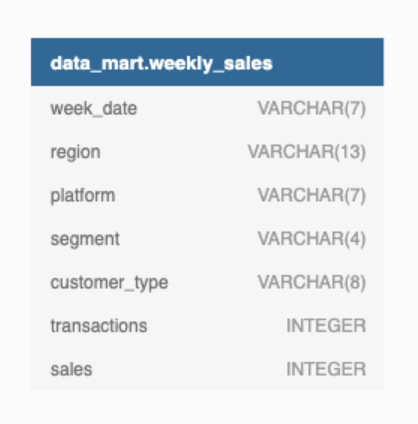
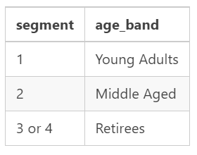
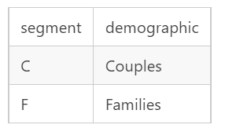

# Case Study 5-Data Mart

## Problem Statement: [Data Mart](https://8weeksqlchallenge.com/case-study-5/)





### Status: Completed

## 1. Data Cleansing Steps

In a single query, perform the following operations and generate a new table in the data_mart schema named clean_weekly_sales:

* Convert the week_date to a DATE format
* Add a week_number as the second column for each week_date value, for example any value from  
  the   1st of January to 7th of January will be 1, 8th to 14th will be 2 etc
* Add a month_number with the calendar month for each week_date value as the 3rd column
* Add a calendar_year column as the 4th column containing either 2018, 2019 or 2020 values
* Add a new column called age_band after the original segment column using the following mapping on the number inside the segment value



* Add a new demographic column using the following mapping for the first letter in the segment values:



* Ensure all null string values with an "unknown" string value in the original segment column as well as the new age_band and demographic columns

* Generate a new avg_transaction column as the sales value divided by transactions rounded to 2 decimal places for each record

```sql
CREATE TABLE data_mart.clean_weekly_sales AS 
(
   SELECT
      to_date(week_date, 'dd-mm-yyyy') AS DATE,
      date_part('month', to_date(week_date, 'dd-mm-yyyy')) AS week_month,
      date_part('year', to_date(week_date, 'dd-mm-yyyy')) AS week_year,
      region,
      platform,
      segment,
      CASE
         WHEN
            RIGHT(segment, 1) = '1' 
         THEN
            'Young Adults' 
         WHEN
            RIGHT(segment, 1) = '2' 
         THEN
            'Middle Age' 
         WHEN
            RIGHT(segment, 1) = '3' 
            OR RIGHT(segment, 1) = '4' 
         THEN
            'Retirees' 
         ELSE
            'Unknown' 
      END
      AS age_band, 
      CASE
         WHEN
            LEFT(segment, 1) = 'C' 
         THEN
            'Couples' 
         WHEN
            LEFT(segment, 1) = 'F' 
         THEN
            'Families' 
         ELSE
            'Unknown' 
      END
      AS demographic, customer_type, round((sales / transactions), 2) AS avg_transaction 
   FROM
      data_mart.weekly_sales 
)
;
SELECT
   * 
FROM
   data_mart.clean_weekly_sales LIMIT 10
```

## 2. Data Exploration

### 1. What day of the week is used for each week_date value?

```sql
SELECT
   TO_CHAR(date, 'day') 
FROM
   data_mart.clean_weekly_sales 
   group by 1
```

### 2. What range of week numbers are missing from the dataset?

```sql
WITH full_year_week AS 
(
   SELECT
      GENERATE_SERIES(1, 52) AS week_number
)
SELECT DISTINCT
   fy.week_number 
FROM
   full_year_week fy 
   LEFT JOIN
      clean_weekly_sales cws 
      ON cws.week_year = fy.week_number 
WHERE
   cws.week_year IS NULL
```

### 3. How many total transactions were there for each year in the dataset?

```sql
SELECT
   date_part('year', to_date(week_date, 'dd-mm-yyyy')) AS week_year,
   COUNT(*) AS transaction_count 
FROM
   weekly_sales 
GROUP BY
   1 
ORDER BY
   1 ASC
```

### 4. What is the total sales for each region for each month?

```sql
SELECT
   region,
   date_part('month', to_date(week_date, 'dd-mm-yyyy')) AS month_year,
   SUM(sales) AS transaction_sum 
FROM
   weekly_sales 
GROUP BY
   1,
   2 
ORDER BY
   1,
   2 ASC
```

### 5. What is the total count of transactions for each platform?

```sql
SELECT
   platform,
   COUNT(DISTINCT transactions) AS transaction_count 
FROM
   weekly_sales 
GROUP BY
   1 
ORDER BY
   1 ASC
```

### 6. What is the percentage of sales for Retail vs Shopify for each month?

```sql
WITH total_percentage AS 
(
   SELECT
      date_part('month', to_date(week_date, 'dd-mm-yyyy')) AS month_year,
      platform,
      SUM(sales) AS monthly_sales 
   FROM
      weekly_sales 
   GROUP BY
      month_year,
      platform 
)
SELECT
   month_year,
   ROUND(100 * MAX (
   CASE
      WHEN
         platform = 'Retail' 
      THEN
         monthly_sales 
      ELSE
         NULL 
   END
) / SUM(monthly_sales), 2) AS retail_percentage, ROUND(100 * MAX (
   CASE
      WHEN
         platform = 'Shopify' 
      THEN
         monthly_sales 
      ELSE
         NULL 
   END
) / SUM(monthly_sales), 2) AS shopify_percentage 
FROM
   total_percentage 
GROUP BY
   1 
ORDER BY
   1
```

### 7. What is the percentage of sales by demographic for each year in the dataset?

```sql
WITH demographic_sales AS 
(
   SELECT
      date_part('month', to_date(week_date, 'dd-mm-yyyy')) AS week_month,
      CASE
         WHEN
            RIGHT(segment, 1) = '1' 
         THEN
            'Young Adults' 
         WHEN
            RIGHT(segment, 1) = '2' 
         THEN
            'Middle Age' 
         WHEN
            RIGHT(segment, 1) = '3' 
            OR RIGHT(segment, 1) = '4' 
         THEN
            'Retirees' 
         ELSE
            'Unknown' 
      END
      AS age_band, 
      CASE
         WHEN
            LEFT(segment, 1) = 'C' 
         THEN
            'Couples' 
         WHEN
            LEFT(segment, 1) = 'F' 
         THEN
            'Families' 
         ELSE
            'Unknown' 
      END
      AS demographic, SUM(sales) AS yearly_sales 
   FROM
      weekly_sales 
   GROUP BY
      1, 2, 3 
)
SELECT
   week_month,
   ROUND(100 * MAX (
   CASE
      WHEN
         demographic = 'Couples' 
      THEN
         yearly_sales 
      ELSE
         NULL 
   END
) / SUM(yearly_sales), 2) AS couples_percentage, ROUND(100 * MAX (
   CASE
      WHEN
         demographic = 'Families' 
      THEN
         yearly_sales 
      ELSE
         NULL 
   END
) / SUM(yearly_sales), 2) AS families_percentage, ROUND(100 * MAX (
   CASE
      WHEN
         demographic = 'unknown' 
      THEN
         yearly_sales 
      ELSE
         NULL 
   END
) / SUM(yearly_sales), 2) AS unknown_percentage 
FROM
   demographic_sales 
GROUP BY
   week_month 
ORDER BY
   week_month
```

### 8. Which age_band and demographic values contribute the most to Retail sales?

```sql
WITH demographic_sales AS 
(
   SELECT
      CASE
         WHEN
            RIGHT(segment, 1) = '1' 
         THEN
            'Young Adults' 
         WHEN
            RIGHT(segment, 1) = '2' 
         THEN
            'Middle Age' 
         WHEN
            RIGHT(segment, 1) = '3' 
            OR RIGHT(segment, 1) = '4' 
         THEN
            'Retirees' 
         ELSE
            'Unknown' 
      END
      AS age_band, 
      CASE
         WHEN
            LEFT(segment, 1) = 'C' 
         THEN
            'Couples' 
         WHEN
            LEFT(segment, 1) = 'F' 
         THEN
            'Families' 
         ELSE
            'Unknown' 
      END
      AS demographic, SUM(sales) AS yearly_sales 
   FROM
      weekly_sales 
   GROUP BY
      segment 
)
SELECT
   age_band,
   demographic,
   ROUND(100 * MAX (
   CASE
      WHEN
         demographic = 'Couples' 
      THEN
         yearly_sales 
      ELSE
         NULL 
   END
) / SUM(yearly_sales), 2) AS couples_percentage, ROUND(100 * MAX (
   CASE
      WHEN
         demographic = 'Families' 
      THEN
         yearly_sales 
      ELSE
         NULL 
   END
) / SUM(yearly_sales), 2) AS families_percentage, ROUND(100 * MAX (
   CASE
      WHEN
         demographic = 'unknown' 
      THEN
         yearly_sales 
      ELSE
         NULL 
   END
) / SUM(yearly_sales), 2) AS unknown_percentage 
FROM
   demographic_sales 
GROUP BY
   age_band, demographic 
ORDER BY
   age_band, demographic LIMIT 1
   ```

### 9. Can we use the avg_transaction column to find the average transaction size for each year for Retail vs Shopify? If not - how would you calculate it instead?

```sql
SELECT
   date_part('month', to_date(week_date, 'dd-mm-yyyy')) AS week_month,
   platform,
   ROUND(AVG(transactions), 0) AS avg_transaction_row,
   SUM(sales) / SUM(transactions) AS avg_transaction_group 
FROM
   weekly_sales 
GROUP BY
   1,
   2 
ORDER BY
   1,
   2
```

## 3. Before & After Analysis

This technique is usually used when we inspect an important event and want to inspect the impact before and after a certain point in time.

Taking the week_date value of 2020-06-15 as the baseline week where the Data Mart sustainable packaging changes came into effect.

We would include all week_date values for 2020-06-15 as the start of the period after the change and the previous week_date values would be before

Using this analysis approach - answer the following questions:

### 1. What is the total sales for the 4 weeks before and after 2020-06-15? What is the growth or reduction rate in actual values and percentage of sales?

```sql
WITH changes AS (
  SELECT 
    date_part('month', to_date(week_date, 'dd-mm-yyyy')) AS week_month,
      date_part('year', to_date(week_date, 'dd-mm-yyyy')) AS week_year, 
    SUM(sales) AS total_sales
  FROM weekly_sales
  WHERE (date_part('month', to_date(week_date, 'dd-mm-yyyy')) BETWEEN 21 AND 28) 
    AND (date_part('year', to_date(week_date, 'dd-mm-yyyy')) = 2020)
  GROUP BY 1,2
),
changes_2 AS (
  SELECT 
    SUM(CASE WHEN week_month BETWEEN 21 AND 24 THEN total_sales END) AS before_change,
    SUM(CASE WHEN week_month BETWEEN 25 AND 28 THEN total_sales END) AS after_change
  FROM changes)

SELECT 
  before_change, 
  after_change, 
  after_change - before_change AS variance, 
  ROUND(100 * (after_change - before_change) / before_change,2) AS percentage
FROM changes_2
```

### 2. What about the entire 12 weeks before and after?

```sql
WITH changes AS (
  SELECT 
    week_date, 
    week_number, 
    SUM(sales) AS total_sales
  FROM clean_weekly_sales
  WHERE (week_number BETWEEN 13 AND 37) 
    AND (calendar_year = 2020)
  GROUP BY week_date, week_number
),
changes_2 AS (
  SELECT 
    SUM(CASE WHEN week_number BETWEEN 13 AND 24 THEN total_sales END) AS before_change,
    SUM(CASE WHEN week_number BETWEEN 25 AND 37 THEN total_sales END) AS after_change
  FROM changes)

SELECT 
  before_change, 
  after_change, 
  after_change - before_change AS variance, 
  ROUND(100 * (after_change - before_change) / before_change,2) AS percentage
FROM changes_2
```

### 3. How do the sale metrics for these 2 periods before and after compare with the previous years in 2018 and 2019?

```sql
WITH summary AS 
(
   SELECT
      calendar_year,
      -- added new column
      week_number,
      SUM(sales) AS total_sales 
   FROM
      clean_weekly_sales 
   WHERE
      (
         week_number BETWEEN 21 AND 28
      )
   GROUP BY
      calendar_year,
      week_number 
)
,
summary_2 AS 
(
   SELECT
      calendar_year,
      SUM(
      CASE
         WHEN
            week_number BETWEEN 13 AND 24 
         THEN
            total_sales 
      END
) AS before_sales, SUM(
      CASE
         WHEN
            week_number BETWEEN 25 AND 28 
         THEN
            total_sales 
      END
) AS after_sales 
   FROM
      summary 
   GROUP BY
      calendar_year 
)
SELECT
   calendar_year,
   before_sales,
   after_sales,
   after_sales - before_sales AS sales_variance,
   ROUND(100 * (after_sales - before_sales) / before_sales, 2) AS percentage 
FROM
   summary_2
```

## 4. Bonus Question

### 1. Which areas of the business have the highest negative impact in sales metrics performance in 2020 for the 12 week before and after period?

* region
* platform
* age_band
* demographic
* customer_type

*Do you have any further recommendations for Danny’s team at Data Mart or any interesting insights based off this analysis?*

```text
The Shopify Couples group performed worse than other groups in year 2020.
```
